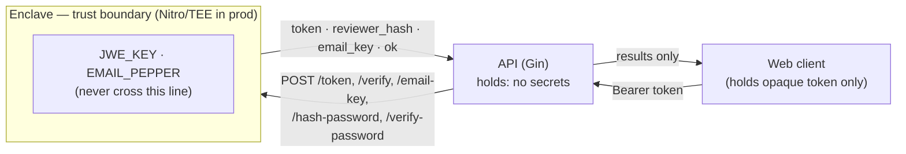
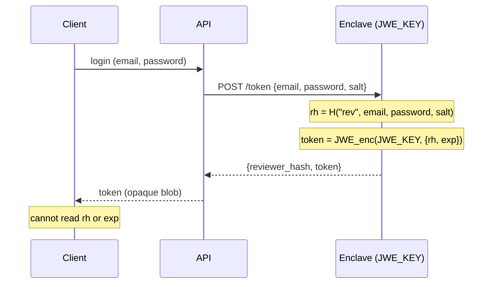
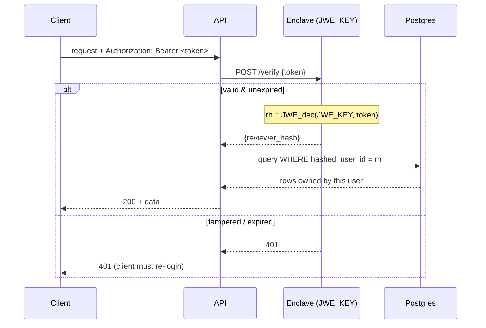
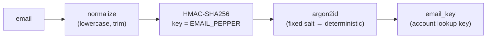

# TenantVoices Enclave

**Trusted Execution Environment (TEE) / Enclave for TenantVoices**

This repository contains the **enclave logic** for TenantVoices’ encrypted review ingestion system.  
It is intended for transparency.
---

## Overview

The enclave’s current responsibility is **anonymizing reviewer identity**:

1. Take the reviewer’s email (or other identifier).  
2. Compute a deterministic, non-reversible hash using HMAC-SHA256 with a secret PEPPER.  
3. Return the `reviewer_hash` to the backend to be stored alongside the review.  

> The `reviewer_hash` allows linking multiple reviews from the same user **without storing any real email or PII**.  
> The displayed reviewer name is a pseudonym; no real names are stored or displayed.

> In production, the enclave runs inside a secure environment such as **AWS Nitro Enclaves**, **Cloud HSM**, or **Vault**, and **never exposes private keys or secrets in the filesystem**.

---

## Features (Public-Friendly)

- HMAC-SHA256 hashing of reviewer emails (with secret PEPPER)  
- Deterministic, non-reversible `reviewer_hash`  
- Public-friendly test client to simulate encrypted email submission  

---

## Secrets & configuration

The enclave guards two secrets:

| Secret         | Env var        | Purpose                                            |
|----------------|----------------|----------------------------------------------------|
| JWE key        | `JWE_KEY`      | AES-256 key (exactly 32 bytes) encrypting session tokens |
| Email pepper   | `EMAIL_PEPPER` | Mixed into the deterministic `email_key` so a leaked accounts table can't be enumerated by guessing emails |

Behavior is selected by `ENV`:

- **`ENV=dev` (or unset)** — local dev mode. Fixed, well-known dev values are used for both secrets. **Never use this in production.**
- **`ENV` = anything else** — production mode. Both `JWE_KEY` and `EMAIL_PEPPER` are **required**; the process **refuses to start** (exits non-zero) if either is missing or `JWE_KEY` is not 32 bytes. There is no hardcoded fallback, so a misconfigured deploy fails loudly instead of silently using a publicly known key.

### Production (Nitro Enclave) key path

For the MVP there is no real enclave, so production mode reads both secrets from the environment. The intended production deployment replaces the env reads in `fetchJWEKeyProd` / `fetchEmailPepperProd` with a **KMS Decrypt call (or a read from sealed enclave memory) gated on a successful attestation document**, so each secret is released only to a verified enclave image and never transits an env var, disk, or the host. The required-and-fail-closed contract stays the same — only the source of the bytes changes.

---

## Flow diagrams

> Rendered with [Mermaid](https://mermaid.js.org/), which GitHub displays inline.

### Secret confinement

`JWE_KEY` and `EMAIL_PEPPER` never leave the enclave. The API holds no secrets — it
asks the enclave to use them over HTTP and only ever handles the opaque results
(an encrypted token, or a derived hash).

### Minting a token (`POST /token`)

The enclave derives the salted `reviewer_hash = H("rev", email, password, salt)`
and seals it (plus an expiry) inside an AES-256-GCM JWE. The `reviewer_hash` is
returned to the API so it can be stored on review rows; the `token` is what the
client receives.

### Verifying a token (`POST /verify`)

Every authenticated request, the API hands the opaque token back to the enclave,
which decrypts it with `JWE_KEY`, checks expiry, and returns the `reviewer_hash`.
That hash — derived server-side, never sent by the client — is what scopes
ownership in the database (`WHERE hashed_user_id = reviewer_hash`).

### Deriving the email key (`POST /email-key`)

`email_key` is the deterministic account-lookup key. The pepper is HMAC'd in
*inside* the enclave so a leaked `accounts` table can't be enumerated by guessing
emails — the attacker would also need `EMAIL_PEPPER`.

